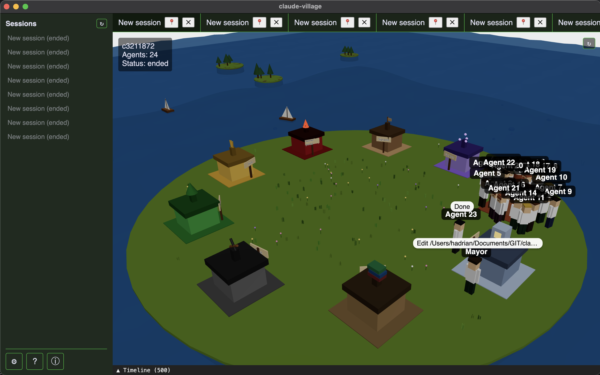
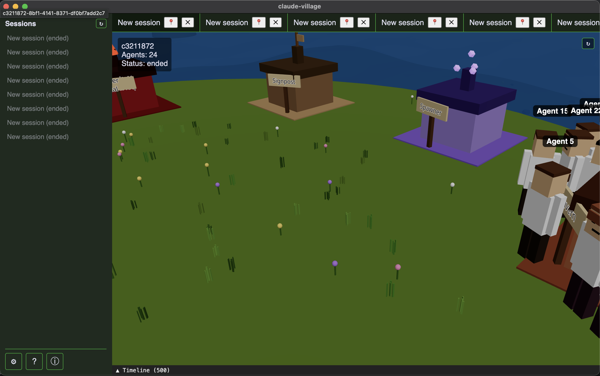
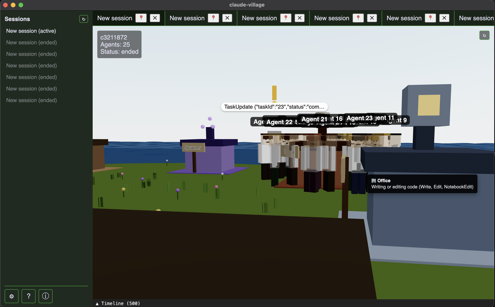
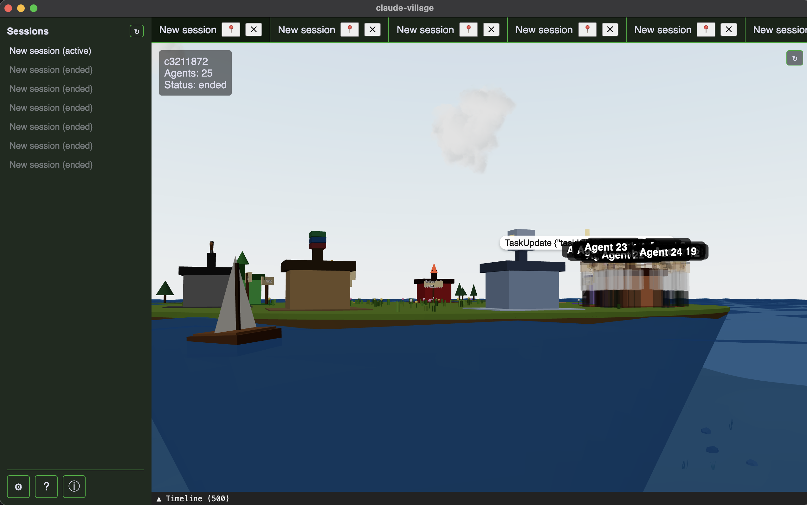
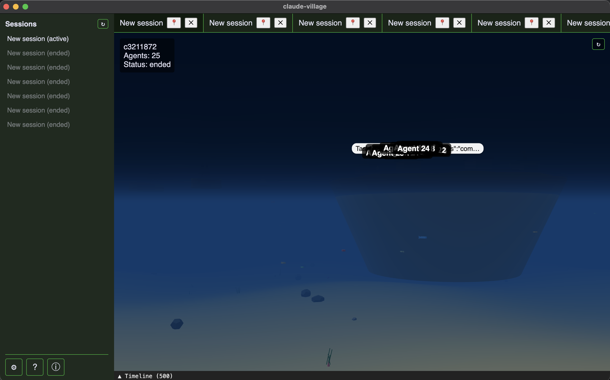
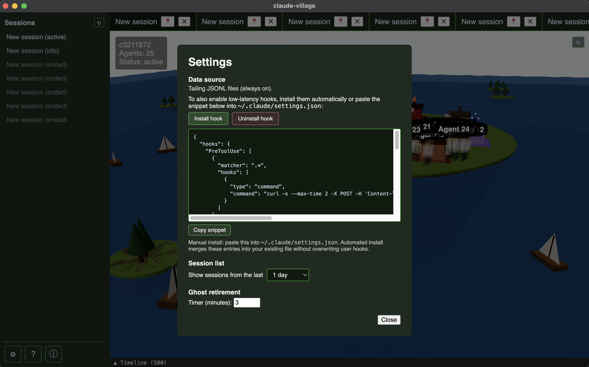
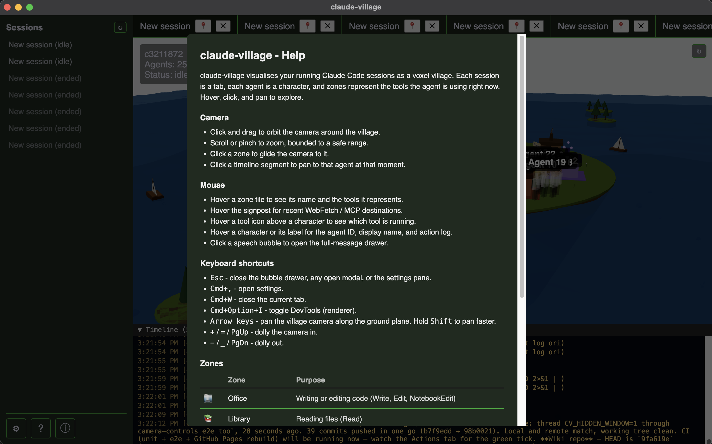

# claude-village

A Mac desktop app that visualizes running Claude Code sessions as an animated Minecraft-style village.

Each session is a tab. Each agent is a voxel character walking between themed zones based on what tool it is using right now - reading files in the library, writing code in the office, searching in the mine, running tests on the farm, committing in the nether portal, and so on.

## Screenshots

_The village seen from orbit: nine tool-mapped zones on a round island, agents clustered by the zone they are using right now, boats cruising the sea, minor islands dotted around the horizon._

_Close look at the grass cap: scattered grass tufts and flowers, signposts in front of each zone, a cluster of agents standing beside the Spawner._

_Agents clustered at the Office building. Each character has a name label; the latest action shows up as a speech bubble (here "TaskUpdate ...") and hovering any object opens a tooltip (Office / "Writing or editing code")._

_Wide-angle view across the water - clouds overhead, boats sailing past, a school of villagers on the shoreline, minor island in the distance._

_Dive the camera below the waterline and the scene swaps to an underwater atmosphere: blue-teal fog, the sky hides, a sandy seabed with rocks and seagrass comes into view, and a school of fish drifts past._

_Settings dialog. The **Install hook** and **Uninstall hook** buttons merge our entries into `~/.claude/settings.json` non-destructively, with a diff preview. The manual snippet stays available. Session-list filter and ghost-retirement timer live here too._

_Built-in Help dialog. Covers camera / mouse / keyboard controls and a live table of zones pulled from the source, so any future zone addition surfaces automatically._

## Quick start

1. Grab the latest `claude-village-<version>-arm64.dmg` from the [releases page](https://github.com/haimadrian/claude-village/releases).
2. Drag `claude-village.app` to `/Applications`, then clear Gatekeeper: `xattr -d com.apple.quarantine /Applications/claude-village.app`.
3. Launch from Launchpad. Open a Claude Code session in any terminal. The sidebar picks it up within a second.

Optional: in Settings, click **Install hook** for lower-latency events. See [Install](docs/install.md) for details.

## Documentation

- [Install](docs/install.md) - download, install, troubleshoot
- [Usage](docs/usage.md) - what the app does and how to drive it
- [Development](docs/development.md) - stack, clone, dev loop, build, package
- [Design](docs/design/2026-04-20-claude-village-design.md) - full spec
- [Implementation plan](docs/plans/2026-04-20-claude-village-plan.md) - task breakdown
- [Progress](docs/progress.md) - live status of tasks
- [Wiki](https://github.com/haimadrian/claude-village/wiki) - camera + mouse + keyboard reference, zones, hooks, architecture, troubleshooting

## Credits

Created by Haim Adrian for Claude Code users.
